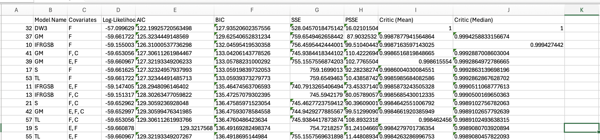
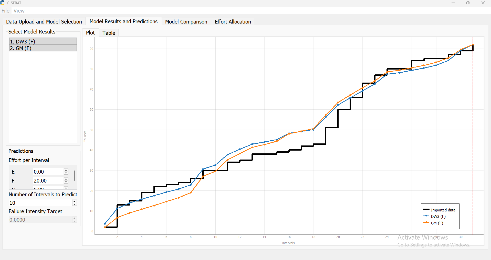
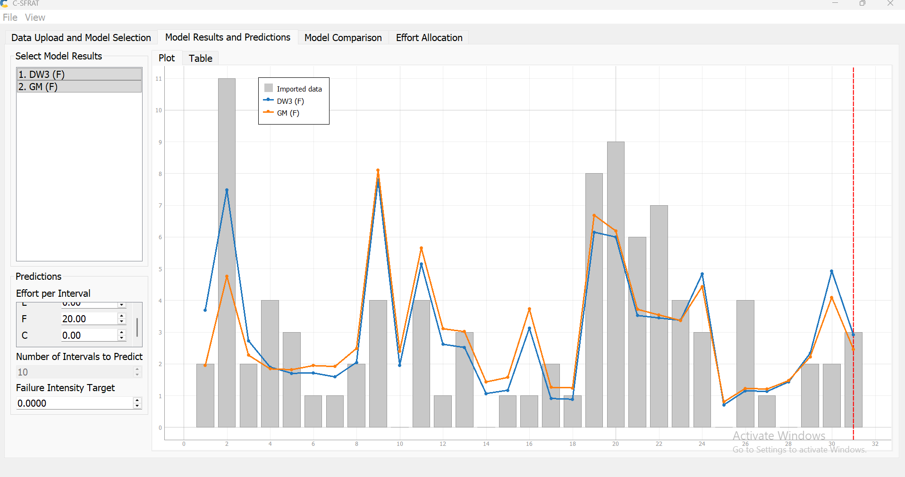

**SENG 637- Dependability and Reliability of Software Systems**

**Lab. Report \#5 – Software Reliability Assessment**

| Group 4       |   |
|-----------------|---|
| Zohara Kamal |   |
| Thanoshan Vijayanandan |   |
| Minh Le |   |
| Shuvam Agarwala |   |

# Introduction
In this assignment, we explore the use of Reliability Growth Testing and Reliability Demonstration Chart to assess the reliability of a software system. Then we will compare these techniques to see what they are like and how they are different from one another.

# Assessment Using Reliability Growth Testing 
For Reliability Growth Testing, we used C-SFRAT as it's the recommended tool in the assignment. We had no trobule in downloading, installing and set up the tool for the analysis. Since C-SFRAT worked for us, we haven't tried other suggested alternative tools like SweET and SFRAT.

### Result of model comparison and range analysis (an explanation of which part of data is good for proceeding with the analysis)
To select top two models, first, we ran all the models for the given failure data with every covariate combination possible. In the process, we obtained the relevant comparison data ([CSV](./artifacts/c-sfrat/model_results_tab_3.csv)). Then, we sorted the Akaike Information Criterion (AIC) and Bayesian Information Criteria (BIC) columns from the lowest values. The reason for this is that, the lower the AIC and BIC score, the better the model ([Choosing the Best Model: A Friendly Guide to AIC and BIC](https://medium.com/@jshaik2452/choosing-the-best-model-a-friendly-guide-to-aic-and-bic-af220b33255f)).

With this process, we determined that the DW3 model, with covariate F is the best model, with AIC of 122.19925720563498 and BIC of 127.93520602357556. Next is the GM model with covariate F with AIC of 125.3234449148569 and BIC of 129.62540652831234.

### Plots for failure rate and reliability of the SUT for the test data provided
Time to Failure Plot:

Intensity Plot:

s

### A discussion on decision making given a target failure rate
s

### A discussion on the advantages and disadvantages of reliability growth analysis
| Aspect                 | Advantages                                                                         | Disadvantages                                                                 |
| ---------------------- | ---------------------------------------------------------------------------------- | ----------------------------------------------------------------------------- |
| Reliability estimation | Helps estimate current reliability and forecast future reliability from test data. | Predictions can be inaccurate if the data is incomplete or noisy.             |
| Fault discovery        | Finds defects systematically so they can be fixed during development.              | Later defects are often harder and more expensive to uncover.                 |
| Project control        | Lets teams track reliability progress and adjust plans early.                      | Can slow development because it adds extra test-fix-retest cycles.            |
| Model use              | Supports comparing different growth models to pick a suitable one.                 | Results depend heavily on choosing the right model.                           |
| Real-world readiness   | Improves product quality before release.                                           | Test conditions may not match real operating conditions, limiting usefulness. |

# Assessment Using Reliability Demonstration Chart 

The RDC-11 Excel worksheet was used to generate the Reliability Demonstration Chart (RDC) as required. However, the default configuration of the tool supports only 16 failures, whereas the provided dataset contains 92 failures. Therefore, the worksheet configuration was modified to accommodate the full dataset.

The default risk parameters provided in the RDC tool:

| Parameter                | Value |
| ------------------------ | ----- |
| Discrimination Ratio (γ) | 2     |
| Developer's Risk (α)     | 0.1   |
| User's Risk (β)          | 0.1   |

The original dataset was given in terms of failure counts per time interval, rather than exact times between failures, which are required for RDC analysis. To address this, the data was transformed by assuming that failures are uniformly distributed within each time interval.

For example:

At T = 1, there are 2 failures → assumed at times 0.5 and 1.0

At T = 2, there are 11 failures → evenly distributed between 1 and 2

| T   | FC  |
| --- | --- |
| 1   | 2   |
| 2   | 11  |

This produces the required time between failures and cumulative time.

Converted Data Example

| Cumulative Failure Count | Time between failures | Cumulative Time |
| ------------------------ | --------------------- | --------------- |
| 1                        | 0.5                   | 0.5             |
| 2                        | 0.5                   | 1               |

This transformation was applied consistently across the entire dataset to generate all 92 failure points required for RDC plotting.

In summary, the dataset required preprocessing before it could be used in the RDC tool. The key steps included:
- Modifying the RDC-11 worksheet to support 92 failures
- Retaining the default risk parameters (γ, α, β)
- Converting interval-based failure data into time-between-failures format using a uniform distribution assumption

This prepared dataset was then used to plot the RDC and assess whether the system meets the required MTTF target.

RDC dataset can be found **[here](modified_artifacts/RDC_Failure_Data.xlsx)**.

## RDC Graphs

### First RDC graph
- Maximum Acceptable Number of Failures = 92
- FIO = 92 failures/31 intervals = 2.97
- MTTF = 1/2.97 = 0.337

### Second RDC graph (minimum MTTF)
The minimum MTTF for the system to be considered acceptable. This minimum was determined by changing the FIO until a minimum was found; where the SUT barely enters the accept region. 
- Maximum Acceptable Number of Failures = 700
- FIO = 700 failures/31 intervals = 22.58
- MTTF = 1/22.58 = 0.044

### Thỉrd RDC graph (double the minimum MTTF)
The third plot is double the minimum MTTF. In this case, the SUT almost goes into the reject region.
- Maximum Acceptable Number of Failures = 350
- FIO = 700 failures/31 intervals = 11.29
- MTTF = 1/22.58 = 0.088

When the MTTF is doubled, the requirement becomes much stricter. This means the system is expected to fail less often. The allowed failure rate becomes smaller. The accept region becomes smaller. Because of this, the failure data gets very close to the reject region. This shows that the system cannot meet this high MTTF requirement. So, this MTTF is too high for the system.

### Fourth RDC graph (half the minimum MTTF)
The fourth plot is half the minimum MTTF. In this case, the SUT goes into the accept region.
- Maximum Acceptable Number of Failures = 1400
- FIO = 700 failures/31 intervals = 45.16
- MTTF = 1/22.58 = 0.022

When the MTTF is cut in half, the requirement becomes easier. This means the system is allowed to fail more often. The allowed failure rate becomes larger. The accept region becomes bigger. Because of this, the failure data clearly falls in the accept region. This shows that the system meets this lower MTTF requirement. So, this MTTF is easy to satisfy, maybe too easy.

Please note that the white region is still the acceptance region (expanded)

# Comparison of Results

# Discussion on Similarity and Differences of the Two Techniques

# How the team work/effort was divided and managed

# 

# Difficulties encountered, challenges overcome, and lessons learned

# Comments/feedback on the lab itself
